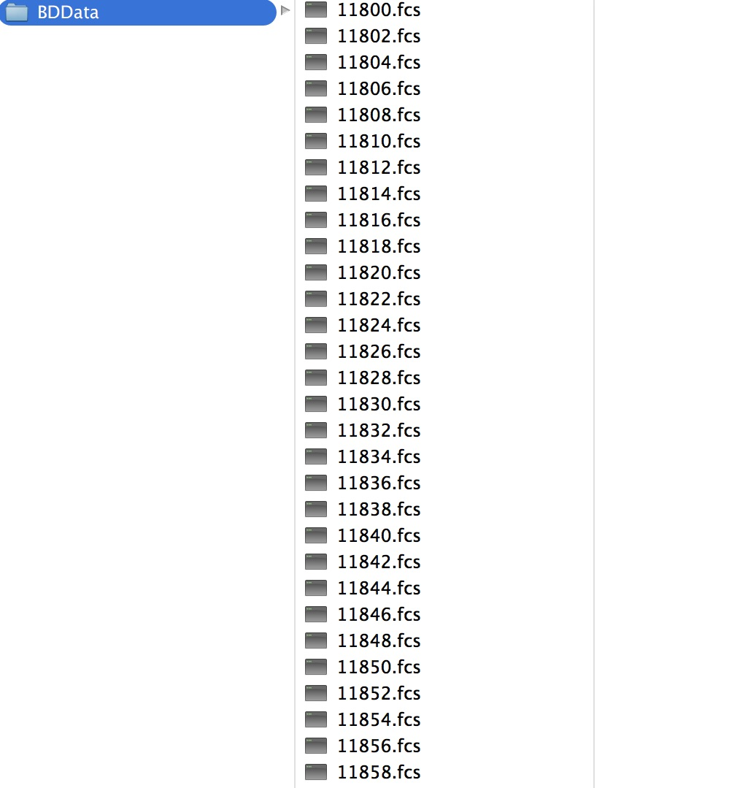
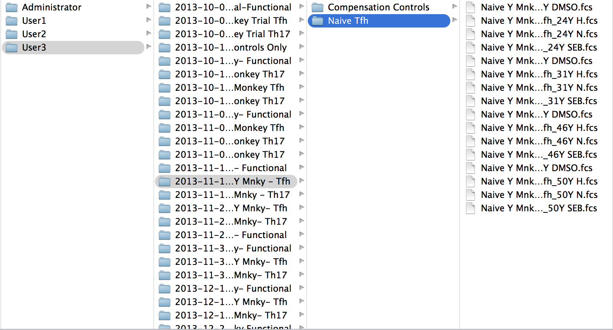

# BDRecovery (Flow Cytometry)
######Recovery of FCS files in the BDData

If you don’t regularly backup your database
when using BD FACS Diva your database might go 
corrupt.  This tool allow you  to recover the files
in the BD Data folder and put them into folders by
/User/Experiment/Specimen 

##Binaries
Binaries for MacOS(64 bit), Windows(64 bit) and WindowsXP(32 bit) are in the ```/bin``` folder. 

+ Usage:  ```./recovery -src BDData Dir -des Backup Dir ``` 
+ Example in MacOS:  ```recovery -src /Users/JDoe/BDdata -des /Users/JDoe/RecoveredFCS```

##Important
I found the best way to do this recovery is to copy the BDData folder from your cytometer's computer to your personal computer.

**Make sure you have enough space for the BDData directory AND recovered files**  Otherwise you will get a program error.  

##Compiling from source
If you choose, you can complie a binary from the source (```recovery.go```).   Make sure you have [Go](https://golang.org/) installed on your system.

+ Building:  ```go build recovery.go```


##Before Recovery 


##After Recovery



